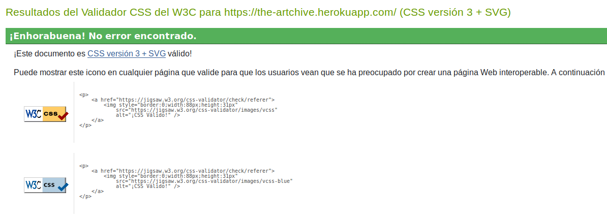
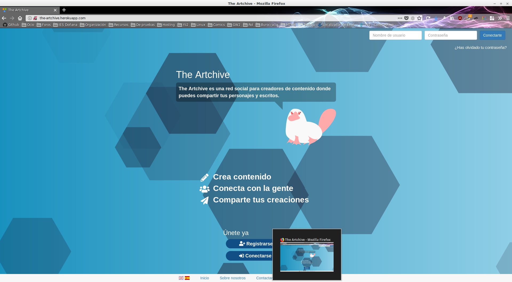
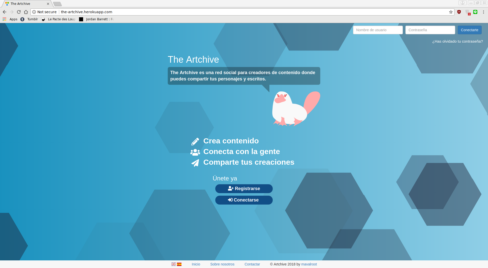
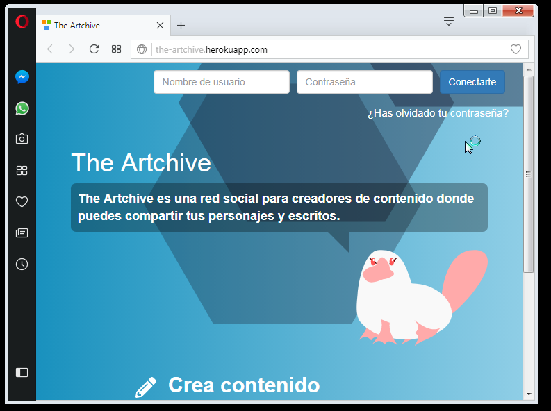
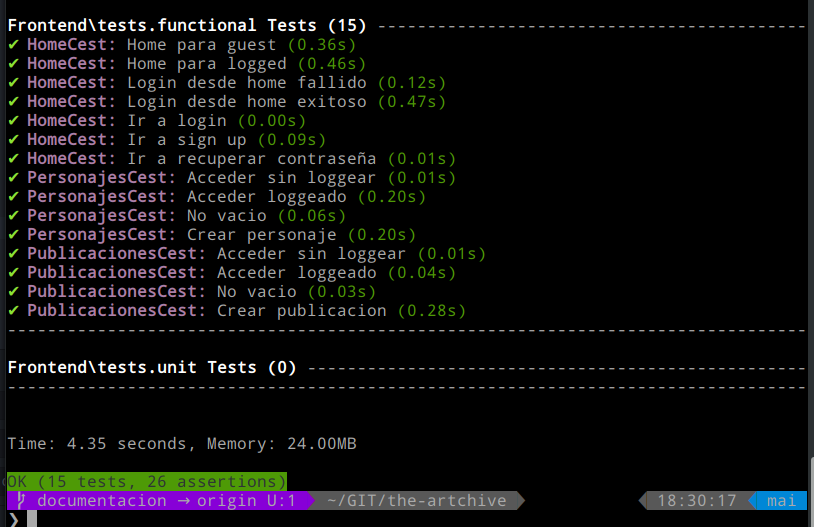

# Anexos

## R32 - Superar pruebas de HTML5 y CSS3

#### Prueba del seis

- ¿Qué sitio es éste?
    - Es una página web tipo red social para creadores de contenido. En la raiz, dependiendo de si nos encontramos loggeados o no, veremos o bien una ventana de recepción que nos invita a unirnos (invitado) o nuestro inicio con la actividad reciente de las personas que sigamos.
- ¿En qué página estoy?
    - Si partimos desde el Inicio, y estando loggeados, nos encontraremos en la página principal en la que podremos ver tanto un resumen con nuestros datos como las publicaciones recientes de aquellos usuarios a los que sigamos.
- ¿Cuáles son las principales secciones del sitio?
    - Las principales secciones a las que tenemos acceso desde el inicio, y como usuario conectado son: Inicio, Notificaciones, Mensajes, Panel de creación (Crear personajes o publicaciones), Buscar, y opciones de usuario (Desconectarnos, ver nuestro contenido, modificar nuestro perfil...).
- ¿Qué opciones tengo en este nivel?
    - En este nivel tengo, además de las opciones anteriores, la capacidad de ver las publicaciones recientes, hacer click en ellas o en su usuario y poder así dejar comentarios.
- ¿Donde estoy en el esquema de las cosas?
    - Dónde nos encontramos se muestra o bien con migas de pan o destacando el nombre de la categoría con un titular grande.
- ¿Cómo busco algo?
    - En la barra de navegación hay un campo de búsqueda, que filtra la búsqueda por usuario o personaje.

#### Validación HTML5

#### Validación CSS3

#### Validación de accesibilidad

*Los errores encontrados son dos botones que tienen iconos dentro y no los reconoce, no voy a arreglarlo.*

#### Vistas en diferentes navegadores

##### Explorer

##### Firefox

##### Chrome

##### Opera

## (R24) Uso de Codeception

#### Pruebas funcionales

