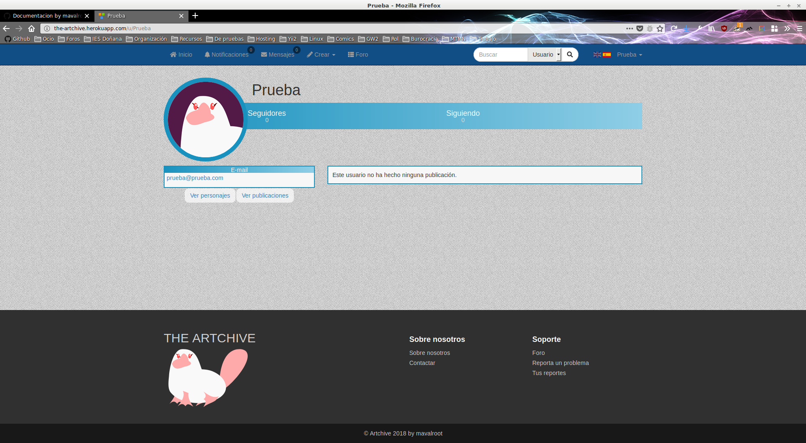
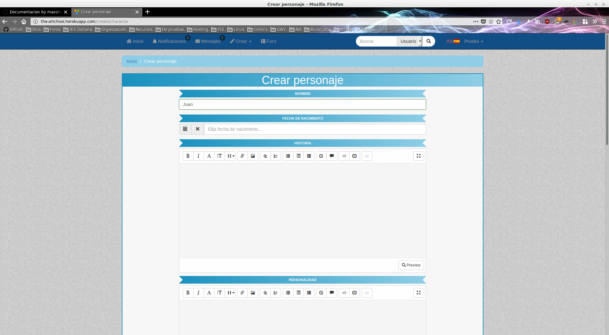
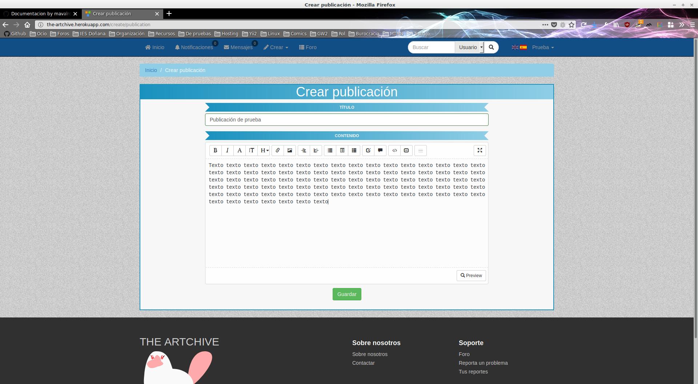
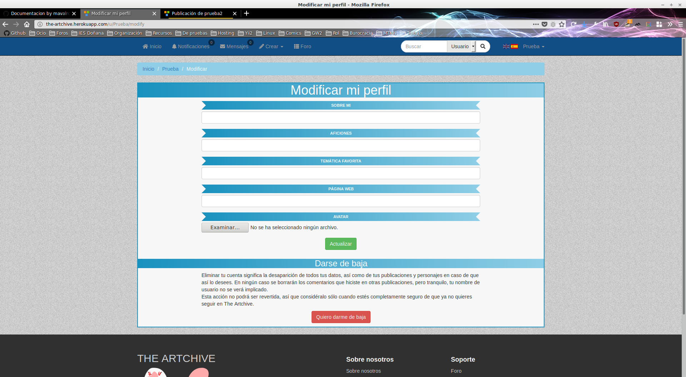
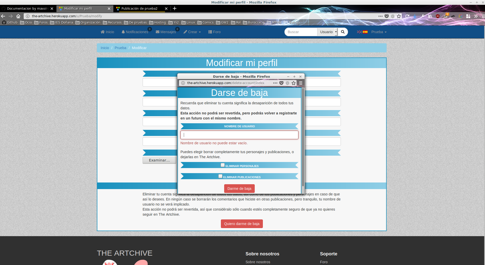

# Manual de usuario

Al entrar en la aplicación, y sin estar conectado, lo primero que veremos será una página explicándonos en qué consiste e invitándonos a que nos unamos.

Por ser la primera vez, nosotros registraremos una cuenta. Pinchamos en "Registrarse" y nos llevará a un formulario que nos pedirá nombre de usuario, mail y contraseña.

Una vez hayamos enviado el registro recibiremos a nuestro correo un código de activación en forma de enlace mediante el cual activaremos nuestra cuenta, y entonces ya podremos conectarnos y disfrutar de la aplicación.

Con una cuenta conectada, entonces, la aplicación se verá de la siguiente manera:

Tenemos un pequeño espacio en el que se indica un resumen de nuestros datos, además de todas las opciones que tenemos a nuestra disposición.

El espacio grande en el que vemos que no hay nada está reservado para el contenido de gente que seguimos. Como nuestra cuenta recién creada no sigue a nadie, entonces por eso no vemos nada.

En la aplicación, podemos hacer cosas tales como:

Ver nuestro perfil.

Crear un personaje.

Crear una publicación.

Modificar nuestro perfil.

Y por supuesto dar de baja nuestra cuenta (desde la modificación de perfil).

Estas son las funcionalidades principales de la aplicación, pero también se puede:

Enviar y recibir mensajes privados, comentar publicaciones, crear relaciones con otros personajes, consultar las notificaciones recibidas, hacer búsquedas, cambiar el idioma de la aplicación, bloquear y seguir a otros usuarios, entrar al foro, hacer reportes...

¡Te invito a que lo averigues por ti mismo!
